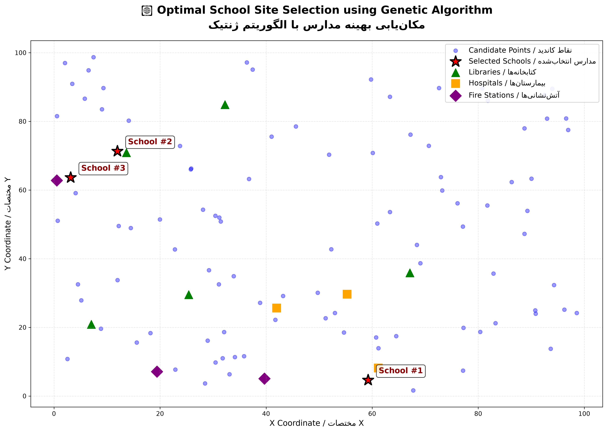

# 🧬 Site Selection Using Genetic Algorithm (GA)

[](https://github.com/mohammad-hussein-dev/site-selection-ga/actions/workflows/ci.yml)
[](https://codecov.io/gh/mohammad-hussein-dev/site-selection-ga)
[](https://www.python.org/downloads/)
[](https://opensource.org/licenses/MIT)
[](https://github.com/psf/black)

> **Optimal school site selection using Genetic Algorithm (GA)** — turning complex spatial optimization into an evolutionary search problem.

---

## 📚 Table of Contents

- [Overview](#-overview)
- [Features](#-features)
- [Technology Stack](#-technology-stack)
- [Installation & Usage](#-installation--usage)
- [Sample Output](#-sample-output)
- [Testing](#-testing)
- [Project Structure](#-project-structure)
- [Development Workflow](#-development-workflow)
- [Contributing](#-contributing)
- [License](#-license)
- [Author](#-author)

---

## 🔍 Overview

This project solves a **spatial optimization problem**: selecting **3 school locations** from **100 candidate points** to maximize population coverage, minimize distance to existing facilities (libraries, hospitals, fire stations), and ensure uniform distribution.

The problem is formulated as a **combinatorial optimization** task and solved using a **Genetic Algorithm (GA)** implemented in Python with the `DEAP` library.

**Perfect for:**
- Learning evolutionary algorithms and metaheuristics
- Spatial optimization and GIS-related problems
- Showcasing clean Python code with scientific computing
- Portfolio projects for aspiring data scientists and optimization engineers

---

## ✨ Features

| Feature | Description |
| :--- | :--- |
| **Genetic Algorithm** | Evolutionary optimization with selection, crossover, and mutation |
| **Custom Fitness Function** | Weighted combination of population coverage, distance to facilities, and spatial spread |
| **Visualization** | 2D scatter plot of candidate points, selected schools, and existing facilities |
| **Modular Code** | Clean, well-structured, and maintainable Python code |
| **Bilingual** | Persian and English comments and output |
| **CI/CD** | GitHub Actions with linting, testing, and coverage |
| **Testing** | Unit tests with pytest and coverage reporting |
| **Pre-commit Hooks** | Code quality checks before every commit |

---

## 🛠️ Technology Stack

| Category | Technologies |
| :--- | :--- |
| **Language** | Python 3.8+ |
| **Optimization** | DEAP (Distributed Evolutionary Algorithms in Python) |
| **Scientific Computing** | NumPy |
| **Visualization** | Matplotlib |
| **Testing** | pytest, pytest-cov |
| **Code Quality** | Black, Ruff, MyPy, Pre-commit |
| **CI/CD** | GitHub Actions, Codecov |
| **OS** | Arch Linux (development), Any Linux / macOS / Windows (runtime) |

---

## ⚙️ Installation & Usage

### 1. Clone the repository

```bash
git clone https://github.com/mohammad-hussein-dev/site-selection-ga.git
cd site-selection-ga
```

### 2. Set up a virtual environment (recommended)

```bash
python -m venv .venv
source .venv/bin/activate  # On Windows: .venv\Scripts\activate
```

### 3. Install dependencies

```bash
pip install -r requirements.txt
```

### 4. Run the main script

```bash
python scripts/run.py
```

Or directly run the module:

```bash
python -m src.site_selection
```

You will see:
- **Generation progress** in the terminal
- **Final results** (selected indices, coordinates, fitness value)
- **2D plot** showing candidate points, selected schools, libraries, hospitals, and fire stations

---

## 📊 Sample Output

### Terminal Output

```
🔄 Running Genetic Algorithm...

gen     nevals  avg             max
0       50      -9.35066        -3.64484
...
100     33      -1.77232        -0.5025

============================================================
🏫 FINAL RESULT / نتیجه نهایی
============================================================
📌 Selected indices: [14, 45, 50]
📍 Coordinates: [[59.24, 4.64], [11.95, 71.32], [3.14, 63.64]]
⭐ Fitness value: -0.5025
============================================================
```

### Plot Output



The plot shows:
- **Blue dots**: 100 candidate points
- **Red stars**: 3 selected school locations
- **Green triangles**: Libraries
- **Orange squares**: Hospitals
- **Purple diamonds**: Fire stations

---

## 🧪 Testing

Run the test suite with:

```bash
pytest tests/
```

Generate a coverage report:

```bash
pytest --cov=src tests/
```

Check code style:

```bash
ruff check .
```

Format code:

```bash
black .
```

---

## 📁 Project Structure

```
site-selection-ga/
├── .github/
│   └── workflows/
│       └── ci.yml                 # GitHub Actions CI
├── src/
│   └── site_selection/
│       ├── __init__.py
│       ├── algorithm.py
│       ├── fitness.py
│       └── visualization.py
├── tests/
│   ├── __init__.py
│   ├── test_fitness.py
│   └── test_algorithm.py
├── scripts/
│   └── run.py
├── README.md
├── requirements.txt
├── requirements-dev.txt
├── .gitignore
├── .pre-commit-config.yaml
├── pyproject.toml
├── setup.py
├── LICENSE
└── .coveragerc
```

---

## 🔄 Development Workflow

1. **Fork** the repository
2. **Create a feature branch**: `git checkout -b feature/your-feature`
3. **Install pre-commit hooks**: `pre-commit install`
4. **Commit changes**: `git commit -m "Add your feature"`
5. **Push**: `git push origin feature/your-feature`
6. **Open a Pull Request**

---

## 🤝 Contributing

Contributions are welcome! Please follow the standard GitHub flow:
- Open an issue to discuss your idea
- Submit a pull request with clear description and tests

---

## 📄 License

This project is open-source and available under the **MIT License**.

---

## 👤 Author

**Mohammad Hussein**  
- GitHub: [@mohammad-hussein-dev](https://github.com/mohammad-hussein-dev)  
- Email: king.mohamd.09876@gmail.com  
- Telegram: @mohammad_hussein_dev

---

> *"Optimization is not just about finding the best answer — it's about understanding the problem deeply enough to know what 'best' really means."*
